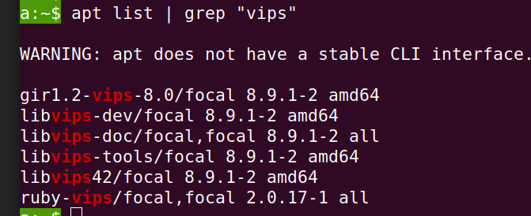

# ActionText в Ruby on Rails. Пользуемся и понимаем как.

Содержание

[Контекст](#ctx)
[Цель](#goal)
[Сгенерированные файлы](#generated)
[Файлы миграции](#migrations)
[Сгенерированные файлы. Остальное.](#generated-rest)
[Связи в таблицах](#tables-relations)
[Как экземпляр нашей модели связывается с экземпляром ActionText в таблице action_text_rich_texts](#how-model-links-to-active-text)
[Возможные ошибки](#errors)

## <span id='ctx'>Контекст</span>
У вас (меня) есть цель - создать раздел, в котором буду храниться статьи, документация, инструкции и другая похожая текстовая информация с картинками для чтения людьми. Соотвественно, есть контент-менеджер, который будет добавлять эту информацию.

## <span id='goal'>Цель</span>
Необходимо создать этот инструмент для контент-менеджера. Для этого я буду использовать класс [ActionText](https://api.rubyonrails.org/classes/ActionText.html) с [соответствующей  документацией](https://guides.rubyonrails.org/action_text_overview.html), который добавляет расширенную возможность редактирования текста в Rails. Он включает в себя редактор [Trix](https://trix-editor.org/), который написан на JavaScript, запускается на стороне клиента(браузера) и рисует довольно дружественный редактор.

## <span id='generated'>Сгенерированные файлы</span>

Активируем ActionText и устанавливаем нужные библиотеки с командой:
```
bin/rails action_text:install
```

После выполнения этой команды вы увидите множество измененных и сгенерированных файлов:


Надо прочитать эти файлы. Пройдемся по ним и узнаем, что происходит:
1. Gemfile.

Мы устанавили гем [image_processing](https://github.com/janko/image_processing). В README написано, что этот пакет нужен, чтобы обрабатывать(сжимать, изменять размер) и загружать рисунки, использует либо [ImageMagick](https://www.imagemagick.org/)/[GraphicsMagick](https://www.imagemagick.org/), либо [libvips](http://libvips.github.io/libvips/). Второй новее и быстрее[wiki-страница об этом](https://github.com/libvips/libvips/wiki/Speed-and-memory-use). Эти библиотеки должны быть установлена у вас на локальном ПК (во время разработки) и на сервере. Этого не написано на странице документации [ActionText](https://guides.rubyonrails.org/action_text_overview.html), но есть странице библиотеки `image_processing`.
Или может у вас уже все установлено, можно проверить командой:
```
  apt list | grep "vips"
```
Вывод будет что-то подобным:


2. Gemfile.lock

Посмотрим библиотеки-зависимости, установленные с `image_processing`:
* [ffi](https://rubygems.org/gems/ffi) - гем для создания динамических связей в фукнциях.
* [mini_magick](https://rubygems.org/gems/mini_magick/) - гем обработки изображений.
* [ruby-vips](https://github.com/libvips/ruby-vips) - гем для связки libvips и руби.

3. app/javascript/application.js

Здесь импортировали JavaScript библиотеки [trix](https://www.npmjs.com/package/trix) и [@rails/actiontext](https://www.npmjs.com/package/@rails/actiontext)

4. config/importmap.rb - здесь создаются соотвествия библотек и сгенерированных js-файлов и отдаются клиенту в соответствии c этими названиями. В DevTools во вкладке Debugger можно посмотреть эти соответсвия на рисунке ниже, где
  1 - просматриваемая страница с редактором
  2 - importmap
  3 - собственно прожеванные файлы (js - ниже, css - выше)
  4 - trix редактор в браузере.


Напомню, что для генерации компилированных css/js файлов используется команда (см. [The Asset Pipeline](https://guides.rubyonrails.org/asset_pipeline.html)):
```
bin/rails assets:precompile
```

## <span id='migrations'>Файлы миграции</span>

Давайте отдельно и внимательнее обсудим файлы миграции, и потом вернемся к остальным сгенерированным файлам.

5. db/migrate/20230210142600_create_active_storage_tables.active_storage.rb

В этом файле описан класс миграции, создающий таблицы в префиксом `active_storage_`:
* `active_storage_blobs`
* `active_storage_attachments`
* `active_storage_variant_records`

Более подробно эти таблицы описаны в документации [Active Storage Overview](https://edgeguides.rubyonrails.org/active_storage_overview.html)

<details>
<summary>Содержимое файла</summary>

```
# This migration comes from active_storage (originally 20170806125915)
class CreateActiveStorageTables < ActiveRecord::Migration[5.2]
  def change
    # Use Active Record's configured type for primary and foreign keys
    primary_key_type, foreign_key_type = primary_and_foreign_key_types

    create_table :active_storage_blobs, id: primary_key_type do |t|
      t.string   :key,          null: false
      t.string   :filename,     null: false
      t.string   :content_type
      t.text     :metadata
      t.string   :service_name, null: false
      t.bigint   :byte_size,    null: false
      t.string   :checksum

      if connection.supports_datetime_with_precision?
        t.datetime :created_at, precision: 6, null: false
      else
        t.datetime :created_at, null: false
      end

      t.index [ :key ], unique: true
    end

    create_table :active_storage_attachments, id: primary_key_type do |t|
      t.string     :name,     null: false
      t.references :record,   null: false, polymorphic: true, index: false, type: foreign_key_type
      t.references :blob,     null: false, type: foreign_key_type

      if connection.supports_datetime_with_precision?
        t.datetime :created_at, precision: 6, null: false
      else
        t.datetime :created_at, null: false
      end

      t.index [ :record_type, :record_id, :name, :blob_id ], name: :index_active_storage_attachments_uniqueness, unique: true
      t.foreign_key :active_storage_blobs, column: :blob_id
    end

    create_table :active_storage_variant_records, id: primary_key_type do |t|
      t.belongs_to :blob, null: false, index: false, type: foreign_key_type
      t.string :variation_digest, null: false

      t.index [ :blob_id, :variation_digest ], name: :index_active_storage_variant_records_uniqueness, unique: true
      t.foreign_key :active_storage_blobs, column: :blob_id
    end
  end

  private
    def primary_and_foreign_key_types
      config = Rails.configuration.generators
      setting = config.options[config.orm][:primary_key_type]
      primary_key_type = setting || :primary_key
      foreign_key_type = setting || :bigint
      [primary_key_type, foreign_key_type]
    end
end
```

</details>

Здесь написаны какие поля создадутся, ограничения полей по уникальности и первичных и внешних ключей. Например, в таблице `active_storage_attachments` создаются поля:
* `name` с ограничением, что он не должен быть пустым(`null`),
* `record_type`
* `record_id` с типом `bigint`, который с `record_type` создаются с опцией `polymorphic: true` (см. [Active Record Migrations References](https://guides.rubyonrails.org/active_record_migrations.html#references)) 
* `blob_id` с типом `bigint`, ссылающийся на запись `id` из таблицы `active_storage_blobs`, имеющий ограничение внешнего ключа по `blob_id`

Также создано ограничение на уникальность комбинации полей `record_type`, `record_id`, `name`,`blob_id`.

6. db/migrate/20230210142601_create_action_text_tables.action_text.rb

В этом файле описан класс миграции, создающий таблицы в префиксом `action_text_` (там всего одна таблица):
* `action_text_rich_texts`

<details>
<summary>Содержимое файла</summary>


```
# This migration comes from action_text (originally 20180528164100)
class CreateActionTextTables < ActiveRecord::Migration[6.0]
  def change
    # Use Active Record's configured type for primary and foreign keys
    primary_key_type, foreign_key_type = primary_and_foreign_key_types

    create_table :action_text_rich_texts, id: primary_key_type do |t|
      t.string     :name, null: false
      t.text       :body, size: :long
      t.references :record, null: false, polymorphic: true, index: false, type: foreign_key_type

      t.timestamps

      t.index [ :record_type, :record_id, :name ], name: "index_action_text_rich_texts_uniqueness", unique: true
    end
  end

  private
    def primary_and_foreign_key_types
      config = Rails.configuration.generators
      setting = config.options[config.orm][:primary_key_type]
      primary_key_type = setting || :primary_key
      foreign_key_type = setting || :bigint
      [primary_key_type, foreign_key_type]
    end
end
```
</details>

После запуска миграции командой `bin/rails db:migrate` в итоге должны появится таблицы в вашей базе данных.


<details>
<summary>Вот так выглядит в Rubymine Database tool window созданные таблицы</summary>


</details>

## <span id='generated-rest'>Сгенерированные файлы. Остальное.</span>

7. test/fixtures/action_text/rich_texts.yml - файл с тестовыми данными.
8. app/assets/stylesheets/actiontext.css


<details>
<summary>Содержимое файла</summary>

```
/*
 * Provides a drop-in pointer for the default Trix stylesheet that will format the toolbar and
 * the trix-editor content (whether displayed or under editing). Feel free to incorporate this
 * inclusion directly in any other asset bundle and remove this file.
 *
 *= require trix
*/

/*
 * We need to override trix.css’s image gallery styles to accommodate the
 * <action-text-attachment> element we wrap around attachments. Otherwise,
 * images in galleries will be squished by the max-width: 33%; rule.
*/
.trix-content .attachment-gallery > action-text-attachment,
.trix-content .attachment-gallery > .attachment {
  flex: 1 0 33%;
  padding: 0 0.5em;
  max-width: 33%;
}

.trix-content .attachment-gallery.attachment-gallery--2 > action-text-attachment,
.trix-content .attachment-gallery.attachment-gallery--2 > .attachment, .trix-content .attachment-gallery.attachment-gallery--4 > action-text-attachment,
.trix-content .attachment-gallery.attachment-gallery--4 > .attachment {
  flex-basis: 50%;
  max-width: 50%;
}

.trix-content action-text-attachment .attachment {
  padding: 0 !important;
  max-width: 100% !important;
}
```
</details>

Вроде бы обычный css файл, но мы видим, что при генерации html используется элемент `action-text-attachment`, которого нет в списке [html-элементов](https://developer.mozilla.org/en-US/docs/Web/HTML/Element) или в [спецификациях](https://html.spec.whatwg.org/review-drafts/2020-01/#toc-semantics), и который генерируется с [Web Components](https://developer.mozilla.org/en-US/docs/Web/Web_Components)

9. app/views/active_storage/blobs/_blob.html.erb

<details>
<summary>Содержимое файла</summary>

```
figure class="attachment attachment--<%= blob.representable? ? "preview" : "file" %> attachment--<%= blob.filename.extension %>">
  <% if blob.representable? %>
    <%= image_tag blob.representation(resize_to_limit: local_assigns[:in_gallery] ? [ 800, 600 ] : [ 1024, 768 ]) %>
  <% end %>

  <figcaption class="attachment__caption">
    <% if caption = blob.try(:caption) %>
      <%= caption %>
    <% else %>
      <span class="attachment__name"><%= blob.filename %></span>
      <span class="attachment__size"><%= number_to_human_size blob.byte_size %></span>
    <% end %>
  </figcaption>
</figure>
```

</details>

Здесь рисуется изображение, данные о которой сохранены в таблице `active_storage_blobs`

10. app/views/layouts/action_text/contents/_content.html.erb

<details>
<summary>Содержимое файла</summary>

```
<div class="trix-content">
  <%= yield %>
</div>
```

</details>

Здесь вставляется `body`, который сохранен в виде html, из строки записи таблицы `action_text_rich_texts`.


## <span id='how-model-links-to-active-text'>Как экземпляр нашей модели связывается с экземпляром ActionText в таблице action_text_rich_texts</span>

В модели мы пишем ассоциацию [`has_rich_text`](https://guides.rubyonrails.org/action_text_overview.html#creating-rich-text-content)
```ruby
class Note < ApplicationRecord
  has_rich_text :body
end
```
Затем, при создании экземпляра в контроллере

```ruby
class NotesController < ApplicationController
  def create
    @note = Note.create!(note_params)

    redirect_to note_path @note # Например
  end
  
  private

  def note_params = params.require(:note).permit(:title, :body)
end
```

через `has_rich_text` в модели работает соответствующий [метод](https://github.com/rails/rails/blob/e9cb3c7b2f63bac810efb46cf8902cadaadcbdcd/actiontext/lib/action_text/attribute.rb#L37) в модуле ActionText::Attribute.

Код с гитхаба репозитория `rails` этого метода читаю так:
* Создаются методы для экземпляра модели предикат `body?`, сеттер и геттер для этого поля.
* Создается [ассоциация](https://guides.rubyonrails.org/association_basics.html#the-has-one-association) `rich_text_body` с именем класса "ActionText::RichText", с именем поля `name`. `as: :record` - признак [полиморфной связи](https://guides.rubyonrails.org/association_basics.html#polymorphic-associations), что также видно было в миграции при созданий таблицы `action_text_rich_texts`. Эта ассоциация инверсная, то есть из экземпляра модели `ActionText::RichText` можно получить значение этого поля через вызов метода `record`.
  
<details>
  <summary>Проверяю в консоли вышенаписанное:</summary>


```ruby
> note = Note.find(1)
=begin
<Note:0x00007efee9a06ce0                                                                
 id: 1,                                                                                  
 title_ru: "What is Lorem Ipsum?",                                                       
 title_en: "РыбаТекст помогает животным",                                                
 hidden: false,                                                                          
 created_at: Sun, 19 Feb 2023 11:24:47.510481000 UTC +00:00,                             
 updated_at: Sun, 19 Feb 2023 11:24:47.613920000 UTC +00:00> 
=end
>
> note.body
=begin
<ActionText::RichText:0x00007efee9848688
 id: 1,                                 
 name: "body",                       
 body: #<ActionText::Content "<div class=\"trix-conte...">,
 record_type: "Note",                   
 record_id: 1,                          
 created_at: Sun, 19 Feb 2023 11:24:47.564128000 UTC +00:00,
 updated_at: Sun, 19 Feb 2023 11:24:47.583755000 UTC +00:00>
=end
>
> action_text_item = ActionText::RichText.find(1)
=begin
<ActionText::RichText:0x00007efee9848688
 id: 1,                                 
 name: "body",                       
 body: #<ActionText::Content "<div class=\"trix-conte...">,
 record_type: "Note",                   
 record_id: 1,                          
 created_at: Sun, 19 Feb 2023 11:24:47.564128000 UTC +00:00,
 updated_at: Sun, 19 Feb 2023 11:24:47.583755000 UTC +00:00>
=end
>
> action_text_item.record
=begin
<Note:0x00007efee9a06ce0                                                                
 id: 1,                                                                                  
 title_ru: "What is Lorem Ipsum?",                                                       
 title_en: "РыбаТекст помогает животным",                                                
 hidden: false,                                                                          
 created_at: Sun, 19 Feb 2023 11:24:47.510481000 UTC +00:00,                             
 updated_at: Sun, 19 Feb 2023 11:24:47.613920000 UTC +00:00>
=end
```
</details>

Итого, видно, что `note.body` и поиск экземпляра `ActionText::RichText` по известному `id` ссылаются на одну и ту же запись, что и показывает, что опция `inverse_of` работает ожидаемо.


---------------------


Later then I wanted to draw a schema of tables relations in mermaid.
Generated ID from action Text doc page.