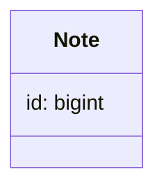

1. Note.create!(note_params)
2. Через has_rich_text в модели работает соответствующий метод https://github.com/rails/rails/blob/e9cb3c7b2f63bac810efb46cf8902cadaadcbdcd/actiontext/lib/action_text/attribute.rb#L37 в модуле ActionText::Attribute

Читаю так: создаются методы для экземпляра модели предикат body?, сеттер и геттер для этого поля. Создается [ассоциация](https://guides.rubyonrails.org/association_basics.html#the-has-one-association) rich_text_body с именем класса "ActionText::RichText", с именем поля `name`. `as: :record` - признак [полиморфной связи](https://guides.rubyonrails.org/association_basics.html#polymorphic-associations), что также видно было в миграции при созданий таблицы `action_text_rich_texts`. Эта ассоциация инверсная, то есть из экземпляра модели  ActionText::RichText можно получить значение этого поля через вызов метода `record`. То есть в консоли мы можем получить так:
```ruby
> note = Note.find(1)
=begin
<Note:0x00007efee9a06ce0                                                                
 id: 1,                                                                                  
 title_ru: "What is Lorem Ipsum?",                                                       
 title_en: "РыбаТекст помогает животным",                                                
 hidden: false,                                                                          
 created_at: Sun, 19 Feb 2023 11:24:47.510481000 UTC +00:00,                             
 updated_at: Sun, 19 Feb 2023 11:24:47.613920000 UTC +00:00> 
=end
>
> note.body
=begin
<ActionText::RichText:0x00007efee9848688
 id: 1,                                 
 name: "body",                       
 body: #<ActionText::Content "<div class=\"trix-conte...">,
 record_type: "Note",                   
 record_id: 1,                          
 created_at: Sun, 19 Feb 2023 11:24:47.564128000 UTC +00:00,
 updated_at: Sun, 19 Feb 2023 11:24:47.583755000 UTC +00:00>
=end
>
> action_text_item = ActionText::RichText.find(1)
=begin
<ActionText::RichText:0x00007efee9848688
 id: 1,                                 
 name: "body",                       
 body: #<ActionText::Content "<div class=\"trix-conte...">,
 record_type: "Note",                   
 record_id: 1,                          
 created_at: Sun, 19 Feb 2023 11:24:47.564128000 UTC +00:00,
 updated_at: Sun, 19 Feb 2023 11:24:47.583755000 UTC +00:00>
=end
>
> action_text_item.record
=begin
<Note:0x00007efee9a06ce0                                                                
 id: 1,                                                                                  
 title_ru: "What is Lorem Ipsum?",                                                       
 title_en: "РыбаТекст помогает животным",                                                
 hidden: false,                                                                          
 created_at: Sun, 19 Feb 2023 11:24:47.510481000 UTC +00:00,                             
 updated_at: Sun, 19 Feb 2023 11:24:47.613920000 UTC +00:00>
=end
```
Выше видно, что `note.body` и поиск экземпляра `ActionText::RichText` по известному `id` ссылаются на одну и ту же запись, что и показывает, что опция `inverse_of` работает ожидаемо.
