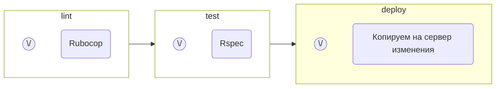

```mermaid
flowchart LR
  subgraph lint
    id1(("\/"))
    rubocop(Rubocop)
  end

  subgraph test
    id2(("\/"))
    rake_test(Rspec)
  end

  subgraph deploy
    id3(("\/"))
    copy_ssh(Копируем на сервер изменения)
  end

  lint --> test --> deploy

  style lint fill:#ffffff, color:#24292f,border-radius:5px, text-align: leftaqua
  style test fill:#ffffff, color:#24292f,border-radius:5px
```
