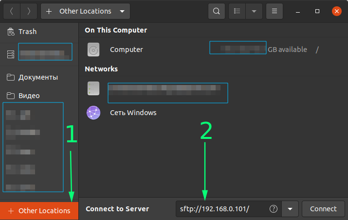
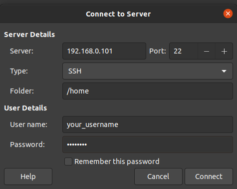

# Доступ между 2-мя ПК с Ubuntu в одной домашней сети для передачи файлов

Моя проблема: переезжаю рабочее место с ноута ПК на другой. Лень создавать новые ssh-ключи и настраивать все. Лешче скопировать нужные файлы конфигурации или вообще всю папку `/home`. Хотя это неплохой повод прибраться в `/home`.

Шаги для установления соединения:

1. На ПК-источнике устанавливаю `openssh-server`:

```bash
sudo apt install openssh-server
```

2. На ПК-приемнике проверяем наличие\устанавливаем `openssh-client`:

```bash
sudo apt install openssh-client
```

3. Узнаем IP-адрес ПК-источника с помощью библиотеки [`ifconfig`](https://en.wikipedia.org/wiki/Ifconfig) или `ip`:

```bash
ifconfig | grep -A 1 wl*
# Наиболее вероятный ответ
# wlp1s0: flags=4163<UP,BROADCAST,RUNNING,MULTICAST>  mtu 1500
#        inet 192.168.0.103  netmask 255.255.255.0  broadcast 192.168.0.255
```

```bash
$ ip address | grep wl*
# Наиболее вероятный ответ
# wlp1s0: <BROADCAST,MULTICAST,UP,LOWER_UP> mtu 1500 qdisc noqueue state UP group default qlen 1000
#    inet 192.168.0.103/24 brd 192.168.0.255 scope global dynamic noprefixroute wlp1s0

```

Командой выше я смотрю строку с наличием подстроки `wl` и 1 строчку после найденной строки(там собственно адрес).

4. На ПК-приемнике соединяюсь в ПК-источнику:

  * Если в `Nautilus` (файловый менеджер по умолчанию) нажимаю:



Вы можете выбрать тип соединения какой вам нравится - sftp, ftp, ssh и др.

  * Если в `Nemo`, делаю `File -> Connect to Server`, в открывшемся окошке вписываю адрес ПК-источника.



5. Ввожу пару логин/пароль и вижу список файлов ПК-источника. У меня есть права на чтение/запись/удаление (полный бог).

6. SSH-ключи.

SSH-ключи мало просто скопировать, надо применить команду

```bash
$ ssh-add <path-to-your-private-ssh-key>
```

Теперь не придется генерить новые ssh-ключи для ваших сервисов,а пользоваться старыми.

## Источники

* [Как мне настроить общий доступ к файлам между двумя ноутбуками Ubuntu в моей беспроводной сети?(в комментах предлагают самые разные варианты)](https://qa.yodo.im/t/kak-mne-nastroit-obshhij-dostup-k-fajlam-mezhdu-dvumya-noutbukami-ubuntu-v-moej-besprovodnoj-seti/3891/2)
* [Почему wl* вместо старого wlan*?(Короткий ответ - изменения в соглашениях по наименованию сетевых интерфейсов)](https://www.freedesktop.org/wiki/Software/systemd/PredictableNetworkInterfaceNames/)
* [Добавление ключа SSH в ssh-agent](https://docs.github.com/ru/authentication/connecting-to-github-with-ssh/generating-a-new-ssh-key-and-adding-it-to-the-ssh-agent#adding-your-ssh-key-to-the-ssh-agent)