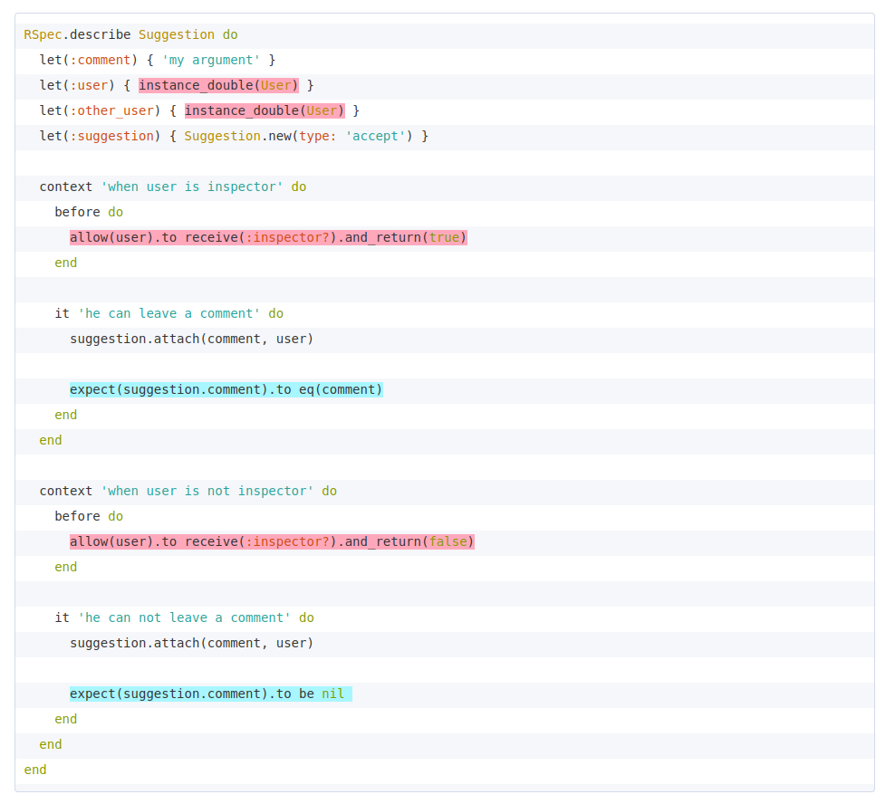

# RSpec библиотеки структурно

При установке rspec я обнаружила, что установила не одну, а несколько библиотек. Я задумалась - почему?

В [Readme репозитория rspec-metagem](https://github.com/rspec/rspec-metagem) написано, что `rspec` - это есть `rspec-metagem`, который зависит от `rspec-core`, `rspec-expectations` and `rspec-mocks`. Команда ниже установит три независимые по сути библиотеки:

```shell
gem install rspec
```

## Выжимка о свойствах каждой библиотеки

### rspec-core

* делает команду rspec доступной из консоли;
* делает доступным команды, которые создают структуру тестов (describe, context, it, specify, example, shared_examples, include_examples, shared_context, include_context, let, before,after,around хуки, described_class).

### rspec-expectations

* обеспечивает команду expect со всем его хозяйством (mathcers):

### rspec-mocks

* поддерживает методы для создания ненастоящих дублей объектов (test-doubles) - double, instance_double, object_spy и др.;
* даёт возможность создать заглушку для методов дубля-объекта с помощью allow, имитируя значение или последовательность значений, возвращающаемое методом самого объекта;
* дает возможность проверить принимаемые аргументы дубля, например, когда дуль передается как аргумент в другую функцию, и внутри этот аргумент должен принять какое-то значение уже своим аргументом.

На рисунке ниже розовенький - rspec-mock, бирюзовый - rspec-expectations, а все остальное - rspec-core (и чуток собственно код).



## Источники

1. [https://www.rubydoc.info/](https://www.rubydoc.info/)
   